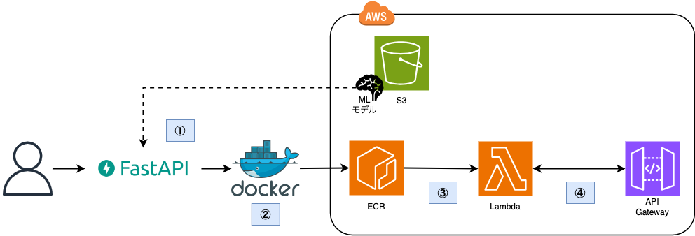

# 東京における降水の有無を予測するモデルを構築しAPI化する

## 目標
昨日の気象データから今日の東京における降水の有無を予測するモデルを構築し、AWS上でAPIとして推論機能を提供する。  

## 手順
1. 気象庁が公開している[気象データ検索サイト](https://www.data.jma.go.jp/obd/stats/etrn/index.php)から過去50年分の気象データを獲得。  

2. 1で獲得したデータを元に機械学習モデルを構築する。  

3. 2で構築したモデルの中で最も精度の良いモデルを用いて推論APIをFastAPIを用いて実装する。
  
## 構成図
推論APIのデプロイ手順および構成図は以下の通り。

1. 事前に構築した機械学習モデルを基にFastAPIを用いてAPI機能を実装。
2. Dockerイメージファイルの構築しECRにPush
3. 2でPushしたイメージを元にLambdaを作成
4. APIGateway + LambdaによるREST APIの構築

## リポジトリの構成
* `Dockerfile`
  * コンテナイメージ作成用ファイル
* `requirements.txt`
  * コンテナにインストールするpythonパッケージリスト
---
* `app.py`
  * 推論機能を提供するAPIを実装しているコード
* `preprocessing.py`  
  * データの前処理を実施するためのコード
---
* `scraping/`
  * 気象データ検索サイトから過去データを取得するためのコード
* `training/`
  * 降水の有無を予測する機械学習モデルを実装するためのコード
